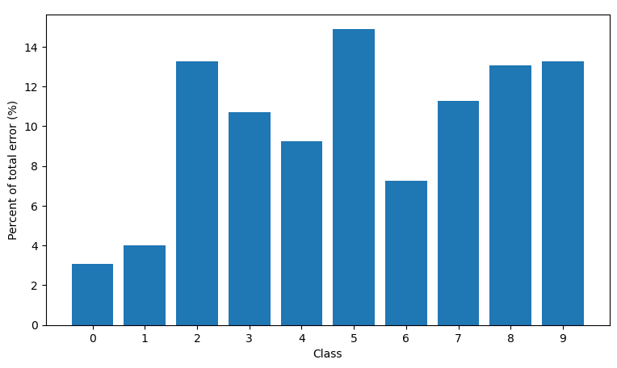

# MNIST Multilayer Perceptron Classifier
This project trains a multilayer perceptron on the MNIST dataset
to classify handwritten numbers. The code uses the torch library to take use
of CUDA to accelerate the learning process. Besides the use of the MNIST dataloader from the torchvision
library everything is programmed from scratch.

## MLP Architecture
The MLP network consists of two hidden layers. Both hidden layer use the
sigmoid activation function. The first hidden layer consists of 32 neurons,
the second hidden layer of 16 neurons. For the output layer the softmax activation is applied.
The mean square error is used to calculate the loss.

(784, Input) => (32, Sigmoid) => (16, Sigmoid) => (10, Softmax) => Mean Square Error

## Instructions
To train the network execute the function train() in train.py. After the training
the model will be saved to models/model.pt. The model can then be evaluated by running
the code inside model_evaluation.ipynb.

## Training Results

## Model Evaluation
### Examples of correct predictions

### Examples of wrong predictions

### Misclassification Rate per Class
